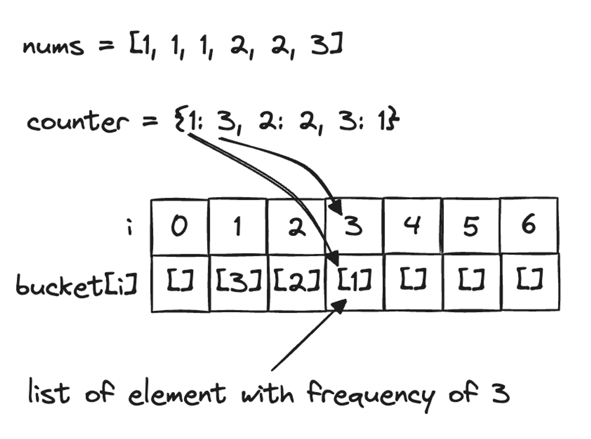
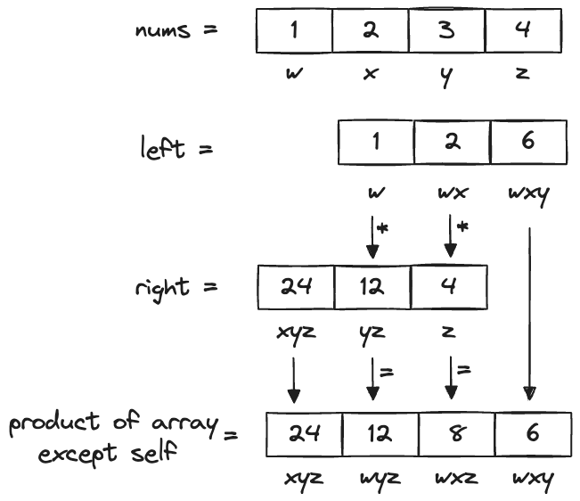

# Other techniques and intuitions

## Array frequency counter

Use Array instead of Hashmap to create a frequency counter. This reduces space complexity from $O(n)$ to $O(1)$.

```python
def fn(word: str):
    for i in range(len(word)):
        char = word[i]
        counter[ord(char) - ord('a')] += 1
```

## Reverse bucket sort



```python
def fn(nums):
    counter = collections.Counter(nums)

    bucket = [[] for i in range(len(nums) + 1)]
    for num, count in counter.items():
        bucket[count].append(num)

    # do logic
```

## Product array except self



<details>
<summary>Example solution for Product of Array Except Self:</summary>

```python
def productExceptSelf(nums: List[int]) -> List[int]:
    n = len(nums)
    left, right = [0] * (n - 1), [0] * (n - 1)

    # create product array from left with size offset by 1
    for i in range(n - 1):
        if i == 0:
            left[i] = nums[i]
        else:
            left[i] = nums[i] * left[i - 1]

    # create product array from right with size offset by 1
    for i in range(n - 1, 0, -1):
        if i == n - 1:
            right[i - 1] = nums[i]
        else:
            right[i - 1] = nums[i] * right[i]

    # offset left and right array by 1
    # Then multiply except right's first elem and left's last elem
    res = []
    for i in range(n):
        if i == 0:
            res.append(right[i])
        elif i == n - 1:
            res.append(left[-1])
        else:
            res.append(left[i - 1] * right[i])

    return res
```

</details>
