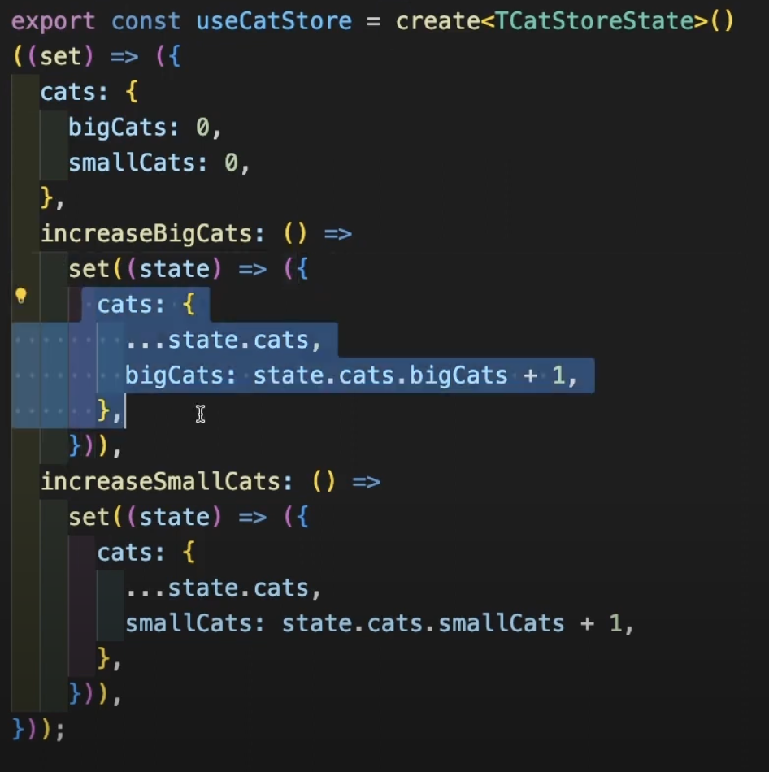
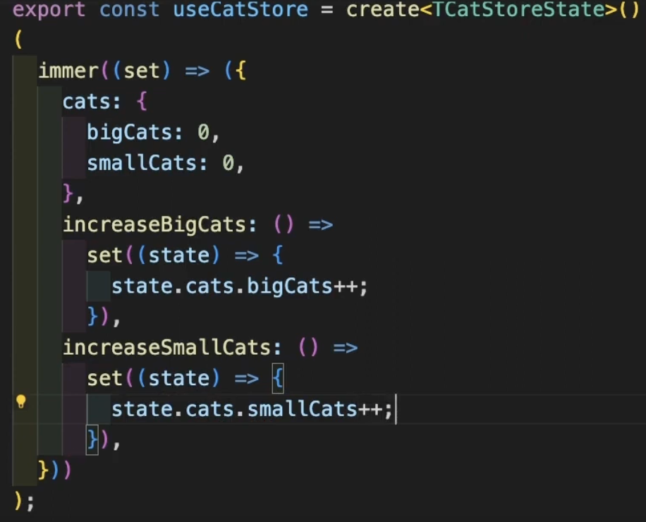

# Zustand

- In the component, you don't necessarily have to call the whole state, you can create a smaller get function to get the latest state. For example:

```tsx
// const spreadsheetData = useSpreadsheetStore((state) => state.spreadsheetData); // no need to do this
const setCellValue = useSpreadsheetStore((state) => state.setCellValue);
const setCellFormula = useSpreadsheetStore((state) => state.setCellFormula);
const getCellValue = useSpreadsheetStore((state) => state.getCellValue);
const getCellFormula = useSpreadsheetStore((state) => state.getCellFormula);
```

## Immer

- Immer middleware (from the Immer libary) let you update immutable object as mutable object [side note: this doesn't sounds like a good practice? mutable object suppose to be mutable for a reason?].
- This is useful when there are deep nested object.

for example, from this


to this

